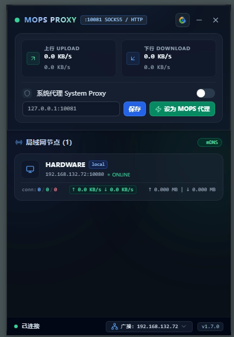
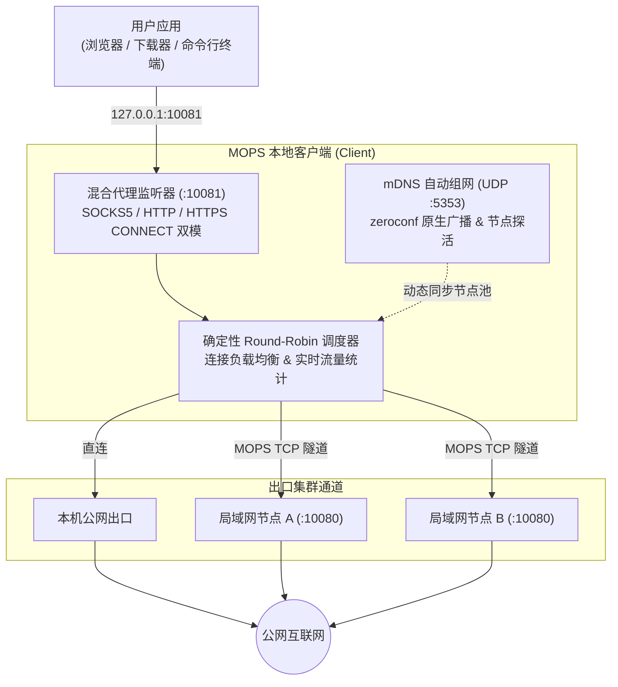

# MOPS — Multi-node Outbound Proxy System

面向 Windows 平台的 Go 语言高性能分布式多节点聚合代理系统。



[](https://go.dev/)
[](https://tauri.app/)
[](https://microsoft.com/windows)
[](LICENSE)

---

## 简介

**MOPS (Multi-node Outbound Proxy System)** 是专为 Windows 平台打造的 Go 语言高性能单体代理系统。通过内存级原生代理内核、局域网 mDNS 自动发现及确定性 Round-Robin 轮询调度，自动聚合局域网内多台设备的公网出口带宽，轻松突破网关单 IP 限速与并发连接瓶颈。

MOPS 提供了两种使用形态：
- 🖥️ **MOPS Desktop** — 基于 Tauri 2.0 + Svelte 5 构建的极简暗黑桌面托盘客户端，支持可视化监控与一键加速。
- ⌨️ **MOPS CLI** — 单文件高性能命令行工具，适合无图形界面环境、脚本自动化或后台常驻。

### 系统架构



---

## 功能特性

- **纯 Go 原生轻量代理内核** — 零外部进程依赖，零 IPC 损耗，单二进制极速启动。
- **SOCKS5 / HTTP 双模混合代理** — 客户端端口（默认 `10081`）智能自适应 SOCKS5、HTTP 代理及 HTTPS CONNECT 隧道，开箱即用。
- **零配置 mDNS 局域网组网** — 基于原生 Go `zeroconf` 广播与发现，智能识别物理网卡，自动剔除 WSL / Hyper-V / VPN 等虚拟网卡干扰。
- **确定性 Round-Robin 负载均衡** — 稳定 1:1 交替分发连接至各在线节点，实现集群多通道带宽聚合。
- **Chrome 一键多通道加速** — 自动探测系统中安装的 Google Chrome 并以多通道优化参数（`--disable-http2 --disable-quic`）启动，突破单长连接限制，跑满节点带宽。
- **P2P 跨节点极速文件传输** — 支持 1MB 流式分块传输、Trailer SHA256 完整性哈希校验、同名自动重命名防覆盖保护及实时进度跟踪。
- **Windows 注册表代理与环境变量联动** — 一键开关 Windows 系统代理，同步维护 `HTTP_PROXY`、`HTTPS_PROXY`、`NO_PROXY` 环境变量并广播即时生效。
- **Tailscale 风格终端 CLI** — `mops status` / `mops status -w` 提供极客风格的终端监控表格，实时查看集群节点、连接数及上下行速率。
- **全功能 RESTful API** — 开放端口 `10082`，支持节点查询、状态监控、系统代理、网卡配置与文件传输等全部操作。

---

## 🖥️ MOPS Desktop 桌面客户端

MOPS 包含专为 Windows 定制的桌面客户端（`bin/MOPS Desktop.exe`），基于 **Tauri 2.0 + Svelte 5 + TailwindCSS** 构建，提供极致轻量的托盘悬浮窗交互：

- 📌 **系统托盘常驻** — 点击 Windows 任务栏右下角托盘图标即可秒级弹出/隐藏控制面板。
- 📈 **实时速率仪表盘** — 顶部实时呈现本机与整个局域网集群的上下行实时网速与累计流量。
- 🌐 **局域网节点视图** — 动态感知同一局域网下的所有 MOPS 节点，展示节点延迟、活跃连接数与在线状态。
- ⚡ **一键启动加速 Chrome** — 顶部闪电按钮一键自动唤起多通道并发优化的 Chrome 浏览器。
- 🔄 **系统代理快捷开关** — 支持一键将 Windows 系统代理切入/切出 MOPS 聚合集群，或自定义指向目标地址。
- 📁 **跨节点文件投送** — 点击任意局域网节点旁的发送图标即可选择文件，底部实时显示传输百分比与进度动画。
- 📶 **广播网卡热切换** — 底部直接选择 mDNS 绑定的物理网卡，适应多网卡、Wi-Fi 与有线切换场景。

---

## 🚀 极速构建与运行

### 快速开始

- **桌面 GUI 客户端**: 启动 `bin/MOPS Desktop.exe`
- **CLI 终端运行**: `bin/mops.exe run`

### 一键构建全套产物

```powershell
# 执行 Windows PowerShell 脚本（一键编译 Go 后端、运行测试并构建 MOPS Desktop 桌面端）
.\build.ps1
```

### 分步编译与测试

```powershell
# 1. 编译 Go CLI 后端
go build -ldflags="-w -s" -o bin/mops.exe ./cmd/mops

# 2. 运行 Go 单元测试与黑盒集成测试
go test -c -o bin/mops.test.exe ./pkg/mops
cmd /c "bin\mops.test.exe -test.v"

# 3. 运行 GUI 桌面端开发与测试 (需 Node.js / Bun 环境)
cd gui
bun install         # 安装前端依赖
bun run test        # 运行 Vitest 单元与集成测试
bun run test:e2e    # 运行 Playwright 端到端 E2E 测试
bun tauri dev       # 启动 Tauri 2.0 桌面端实时热重载开发
```

---

## 💻 CLI 命令行指南

```powershell
# 1. 前台启动 MOPS 节点服务
mops run

# 2. 查看 Tailscale 风格集群状态（-w 开启每秒刷新）
mops status -w

# 3. Windows 系统代理与环境变量控制
mops proxy on               # 开启系统代理指向本机 MOPS (127.0.0.1:10081)
mops proxy off              # 关闭系统代理并清除环境变量
mops proxy set 127.0.0.1:7890 # 自定义设置指定代理地址
mops proxy clear            # 清空代理设置
mops proxy status           # 查看当前系统代理与环境变量状态

# 4. 动态开关客户端 / 服务端中继监听器 (需 MOPS 运行中)
mops client on|off|status   # 客户端 SOCKS5/HTTP 混合代理监听器
mops server on|off|status   # 服务端 TCP 中继监听器

# 5. Windows 系统服务管理 (可选，支持后台常驻守护)
mops service install        # 安装并注册 Windows 服务 (自适应拷贝至 Program Files)
mops service update         # 覆盖更新已注册的系统服务二进制
mops service start          # 启动 Windows 后台服务
mops service stop           # 停止 Windows 后台服务
mops service uninstall      # 卸载系统服务
```

### CLI 参数详解

| 参数 | 说明 | 默认值 |
| :--- | :--- | :--- |
| `--server-port` | Server TCP 服务端中继与文件传输监听端口 | `10080` |
| `--client-port` | Client SOCKS5 / HTTP 混合代理监听端口 | `10081` |
| `--api-port` | RESTful HTTP API 服务端口 | `10082` |
| `--listen` | 本地客户端代理监听绑定 IP | `127.0.0.1` |
| `--hostname` | 节点显示名称 | 本机主机名 |
| `--advertise` | mDNS 局域网广播绑定的出口 IP（留空则自动检测物理网卡） | 自动检测 |
| `--strategy` | 负载均衡策略（`random` / `hash`） | `random` |
| `--download-dir` | 接收跨节点传输文件的存储目录 | `./downloads` |
| `--node` | 显式指定远端节点 IP:Port（支持多次指定，如 `--node 192.168.1.100:10080`） | 无 |

---

## 📡 端口与协议规范

| 组件 | 命令行参数 | 默认端口 | 传输协议 | 说明 |
| :--- | :--- | :--- | :--- | :--- |
| **Server TCP** | `--server-port` | `10080` | TCP | MOPS 节点间中继与 P2P 文件传输通道 |
| **Client 混合代理** | `--client-port` | `10081` | TCP | **SOCKS5 / HTTP / HTTPS CONNECT** 双模自适应代理 |
| **RESTful API** | `--api-port` | `10082` | HTTP | 本地与远程控制 JSON REST API |
| **mDNS 广播** | - | `5353` | UDP | 基于 `_mops-proxy._tcp` 服务的局域网自动感知 |

---

## 🧪 代理使用与测试

### 1. 使用 curl 快速验证代理连通性

```powershell
# 通过 HTTP 代理方式请求
curl.exe -x http://127.0.0.1:10081 https://httpbin.org/ip

# 通过 SOCKS5 代理方式请求
curl.exe -x socks5://127.0.0.1:10081 https://httpbin.org/ip
```

### 2. Chrome 多通道并发加速启动

```powershell
# 手动通过命令行启动加速版 Chrome 浏览器
chrome.exe --disable-http2 --disable-quic --proxy-server="http://127.0.0.1:10081"
```
> 💡 提示：在 MOPS Desktop 界面中点击闪电 ⚡ 图标，即可一键自动探测并启动多通道 Chrome。

---

## 🔌 RESTful API 概览

MOPS 提供丰富的 RESTful API 接口（默认基础路径 `http://127.0.0.1:10082`），详细接口文档参见 **[API.md](API.md)**。

| 接口路径 | 方法 | 说明 |
| :--- | :--- | :--- |
| `/api/v1/status` | `GET` | 获取本机节点状态、监听端口、实时速率与累计流量 |
| `/api/v1/nodes` | `GET` | 获取当前局域网集群所有节点列表与度量信息 |
| `/api/v1/system-proxy` | `GET` / `POST` | 查询或开启/关闭/自定义 Windows 系统代理与环境变量 |
| `/api/v1/client` | `GET` / `POST` | 查询或动态开关 SOCKS5 / 混合代理监听器 |
| `/api/v1/server` | `GET` / `POST` | 查询或动态开关 TCP 服务端中继监听器 |
| `/api/v1/config` | `GET` / `POST` | 查询或修改配置参数（如文件下载路径、广播网卡） |
| `/api/v1/interfaces` | `GET` | 获取当前机器物理及虚拟网络接口列表 |
| `/api/v1/files/transfer` | `POST` | 发起跨节点 P2P 文件传输 |
| `/api/v1/files/progress` | `GET` | 查询当前文件传输进度与百分比 |
| `/api/v1/files/open-dir` | `GET` / `POST` | 一键打开当前文件下载接收目录（唤起 Explorer） |
| `/api/v1/service` | `GET` / `POST` | 查询或控制 Windows 原生系统服务常驻状态 |
| `/api/v1/browser/launch` | `POST` | 一键唤起多通道并发加速版 Google Chrome |

---

## 📄 许可证

本项目基于 [Apache License 2.0](LICENSE) 许可证开源。
